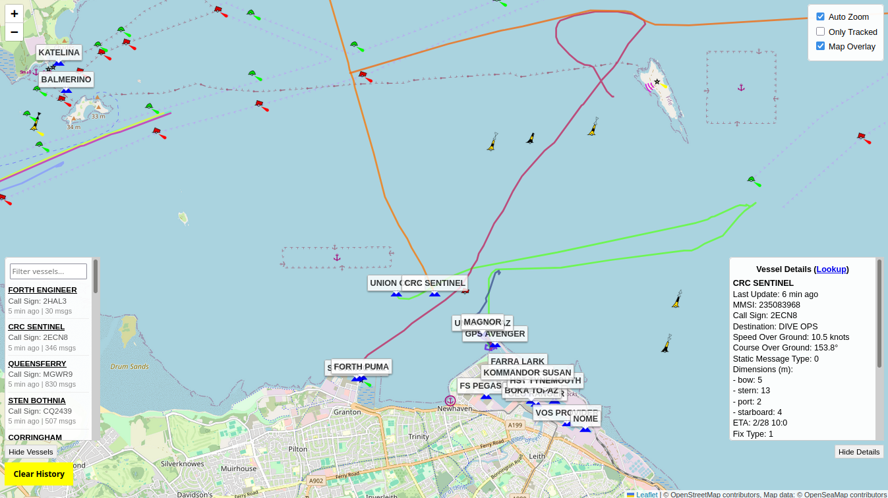

# aisdecode
AIS Decoder and Web based Tracker for serial (and USB) NMEA hardware. Tested with a SevenStar 2rxPro.

1) Clone this repo
2) Download prebuilt binary from [Releases](https://github.com/madpsy/aisdecode/releases) for your OS/Arch (or build your own)
3) Run the binary from within the cloned repo directory (chmod +x first on Linux/Mac)
4) Start sending NMEA 0183 data to UDP port 8101 or configure a `serial` device (or both!)
5) In a browser go to http://127.0.0.1:8100 (or whatever IP address of the host)
6) Make sure it works as expected
7) Fill the missing fields in the file `state/myinfo.json` (your receiver details)
8) Optionally set the command line arguments `-aggregator IP:port` and `--aggregator-public-url https://example.com` to a public aggregator
9) Restart the binary and have fun!

```
Usage of aisdecode:
  -aggregator string
    	Comma delimited list of aggregator host/ip:port (optional)
  -aggregator-public-url string
    	Public aggregator URL to push myinfo.json to on startup (optional)
  -allow-all-uuids
    	If specified, allows all receiver UUIDs (by default, UUIDs are restricted via allowed list)
  -baud int
    	Baud rate (default: 38400), ignored if -serial-port is not specified (default 38400)
  -debug
    	Enable debug output
  -dedupe-window int
    	Deduplication window in milliseconds (default: 1000, set to 0 to disable deduplication) (default 1000)
  -dump-vessel-data
    	Log the latest vessel data to the screen whenever it is updated
  -expire-after duration
    	Expire vessel data if no update is received within this duration (default: 24h)
  -log-all-decodes string
    	Directory path to log every decoded message (optional)
  -no-state
    	When specified, do not save or load the state (default: false)
  -serial-port string
    	Serial port device (optional)
  -show-decodes
    	Output the decoded messages
  -state-dir string
    	Directory to store state (default: state)
  -udp-listen-port int
    	UDP listen port for incoming NMEA data (default: 8101)
  -update-interval int
    	Update interval in seconds for emitting latest vessel data (default: 10)
  -web-root string
    	Web root directory (default: web)
  -ws-port int
    	WebSocket port (default: 8100)
```

Example manual cURL to set a receiver location:

```
curl -X PUT \
  -H "Content-Type: application/json" \
  -d '{
    "uuid": "450e8272-e29b-41a3-b421-446655446543",
    "name": "MM3NDH",
    "description": "AIS receiver",
    "latitude": "54.65434",
    "longitude": "-4.4312"
}' \
  https://127.0.0.1:8100/receivers
```


